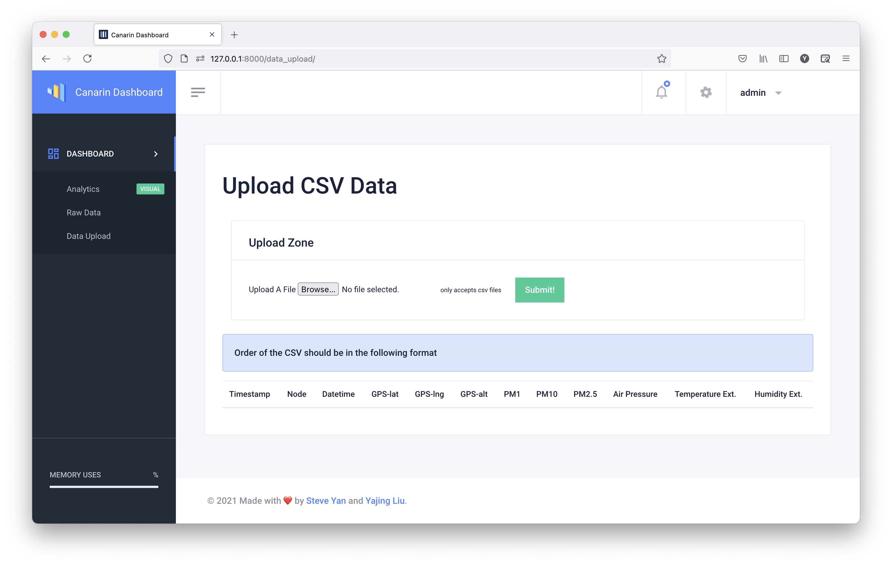
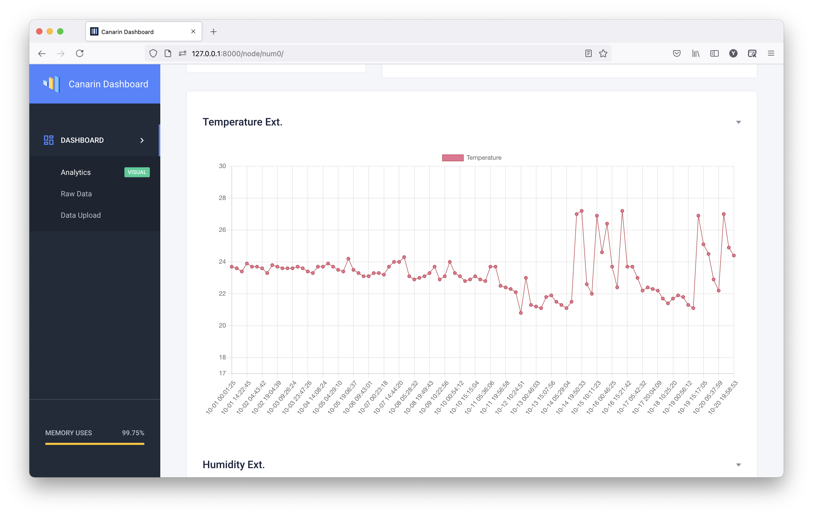
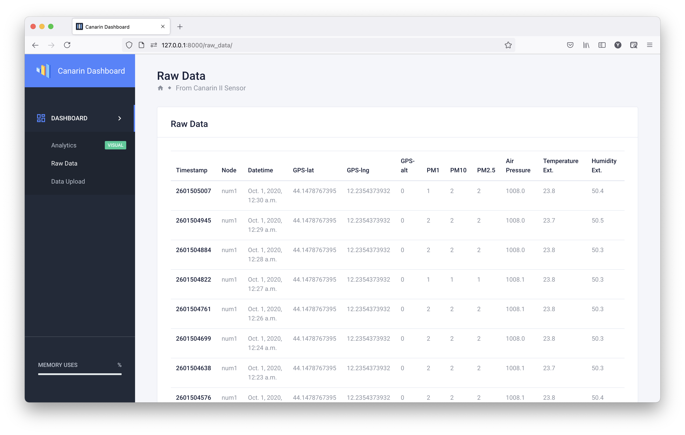
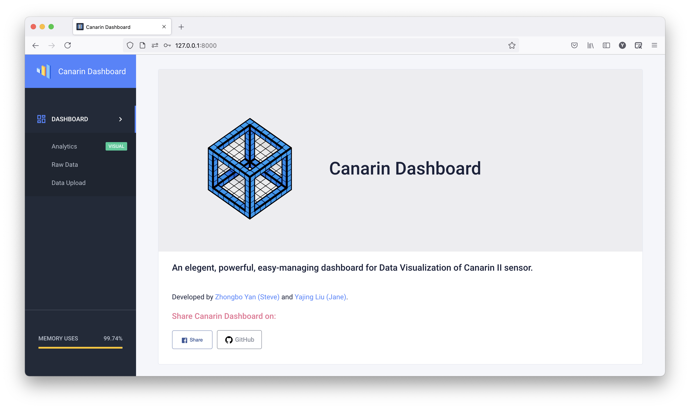
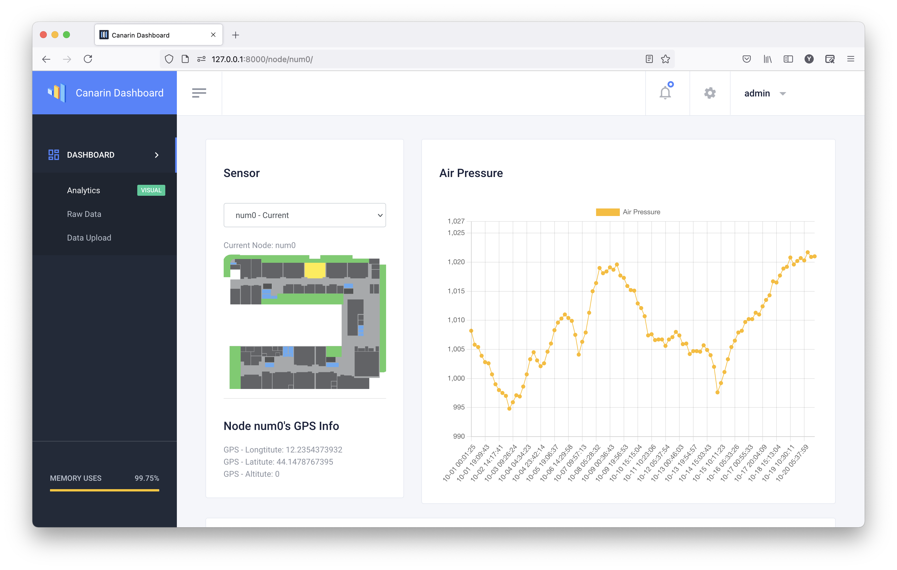

## Title: Canarin II Dashboard
#### Areas: Sensors, data visualization, HCI

### Developer

Yajing Liu, Zhongbo Yan.

### Description: 

An App, the users can interact with a dashboard showing data collected by the Canarin II sensors and the different data it can sense: temperature, relative humidity, PMs, etc. The dashboard show data of a single Canarin II or of a set of many Canarins II. Data visualization strategies is adopted.

### Technologies: 

Sensors (already installed): Canarin II sensor
Map of the Cesena Campus (SVG based)
Application form: web app(responsive for mobile)

### Screenshots

## Issues

1. only one sensor
2. should we use the campus map
